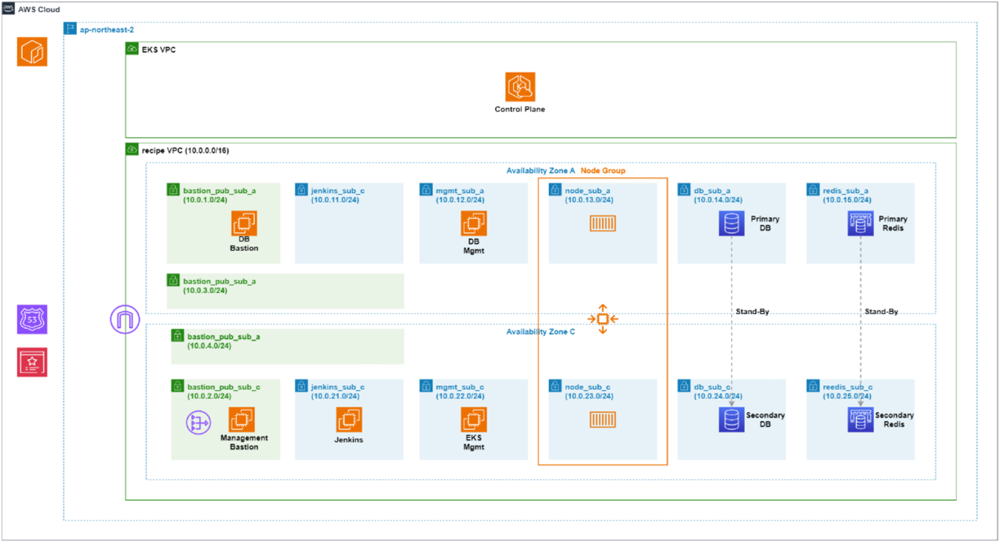
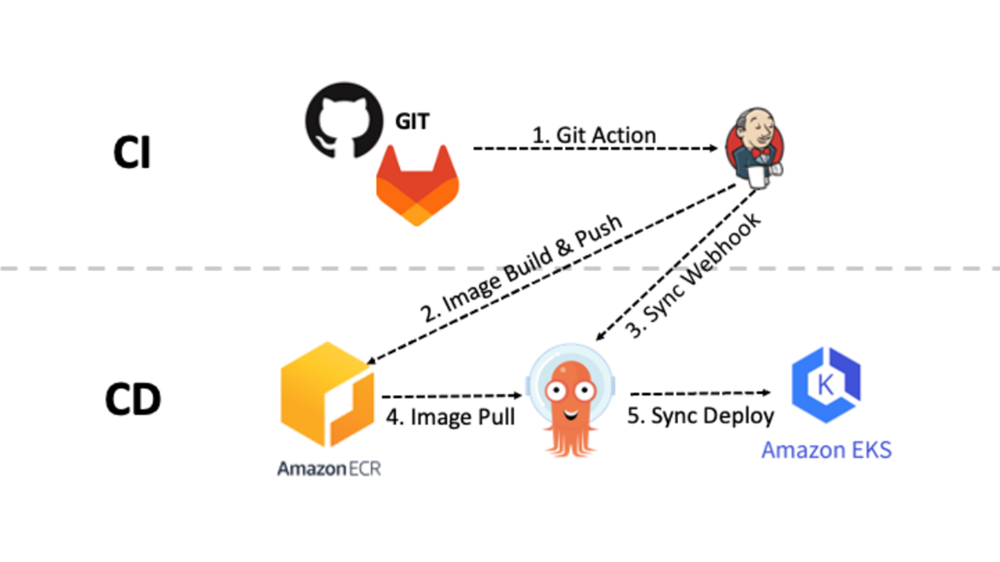
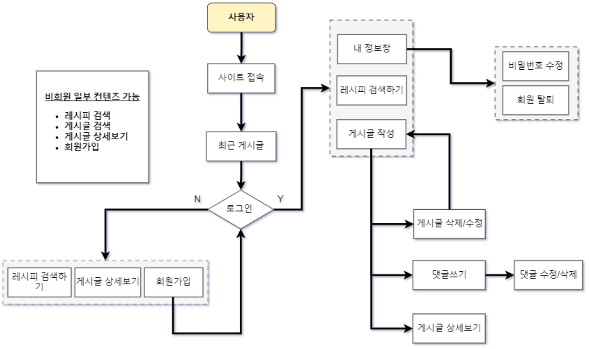
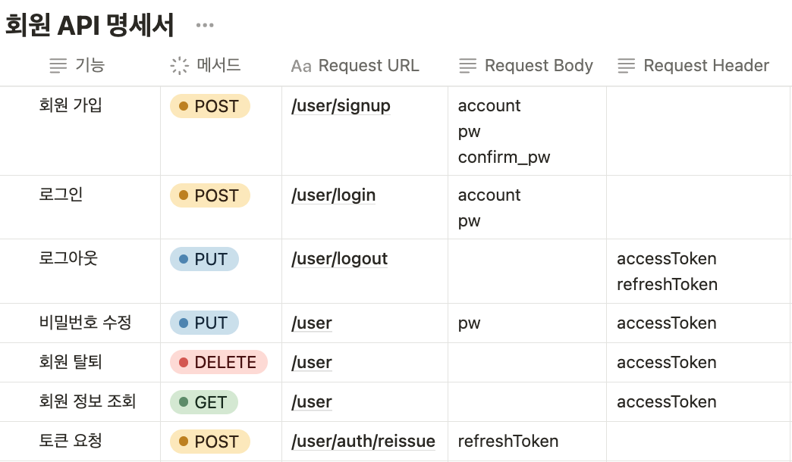
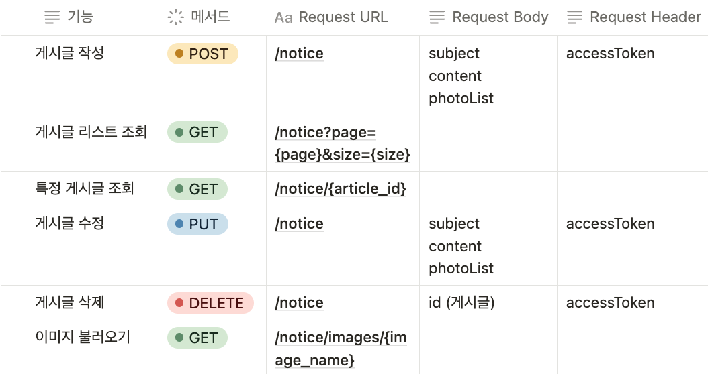
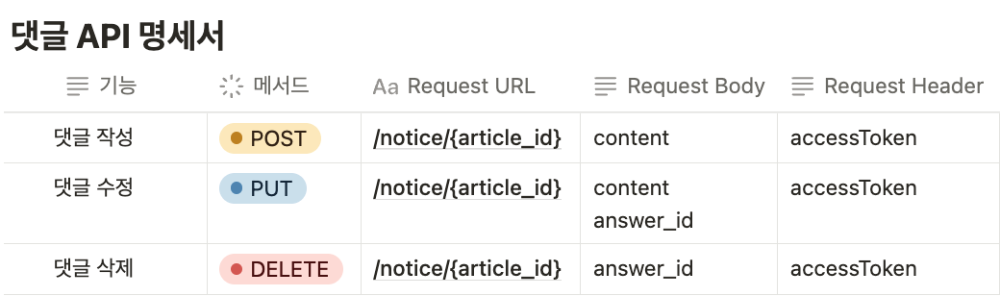
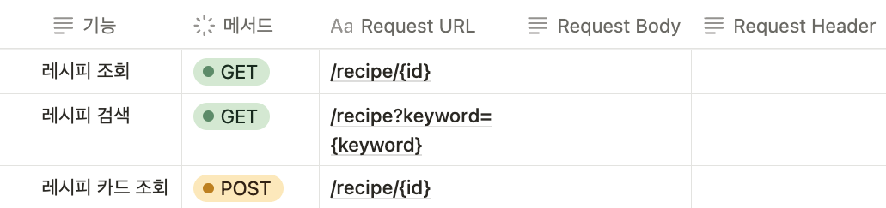
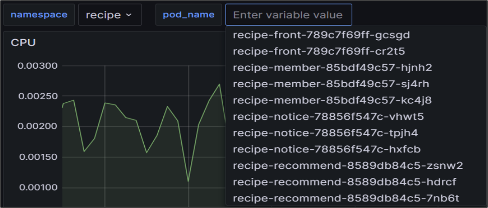

## 🍳 RecipeTips  ( 2023.09.27 ~ 2023.11.01 )

> 'RecipeTips'는 요리에 대한 지식이 부족하거나 배우고 싶은 1인 가족 및 자취생들이 자유롭게 소통하고, 정보를 공유할 수 있는 사이트입니다.

<br>

### 시연 영상
- [서비스 시연 영상](https://youtu.be/ZNQ98Y0HJl8)<br>
- [HPA 시연 영상](https://youtu.be/SyfNZwBn0nM)<br>
- [CI/CD 시연 영상](https://youtu.be/CVYgnCJHCOE)<br>

<br>

### 프로젝트 선정 배경
> Pendemic 이후 외식이 어려워지고 집에서 요리하는 현상이 증가했습니다. 이에 따라 많은 사람들이 직접 요리를 하여 물가 부담을 낮추는 경향이 나타났습니다. 
그러나 사람들은 어떠한 요리를 만들지, 어떻게 조리를 하는지에 대한 고민이 많아졌습니다. 따라서, 이러한 수요를 충족시키고 집에서 요리하는 사람들에게 도움을 주기 위해
"RecipeTips"를 개발하기로 결정했습니다. RecipeTips는 다양한 요리 관련 정보를 제공하고 추천 요리, 조리 방법 등을 소개합니다. 

<br>

### 프로젝트 목표
> 오늘날에는 시스템이 지속적으로 작동하고 사용 가능한 **고가용성**이 강조되고 있습니다. 
이를 위해 **MSA** 애플리케이션을 구성하고 관리하기 위해 Kubernetes를 이용하여 인프라를 구축할 것입니다. 
그리고 개발자들의 생산성을 높이고 개발 Process의 효율성을 극대화하기 위해 
CI/CD 파이프라인을 구축하여 장애에 대해 대비가 가능하고 고가용성과 새로운 버전 업데이트 시 지속적으로 서비스가 
가능한 **무중단 배포**를 목표로 할 것입니다.
또한 지속적이고 안정적인 서비스 운영/관리를 위해 Resource와 Application **모니터링 시스템**을 구축할 것입니다.

<br>

### 역할 분담
> **서명진 (PL)** : K8S, Terraform 구성, Argo, Monitoring 구축<br>
> **최재민** : AWS Infra 구축, 프로젝트 문서화 작성<br>
> **조광희** : Front-end 개발, FlowChart 작성<br>
> **정우용** : Back-end 개발, Jenkins 구축, CI/CD 파이프라인 구축, PPT 제작 

## 사용 기술

#### Infra
    

> EC2 Image : Amazon-Linux 2023<br>
> K8S : 2.7<br>
> Terraform : 5.1.0


#### CI/CD
 

> Jenkins : 2.426.1<br>
> Argo : 2.8.5

#### Front-end

 
 

> React : 18.2.0 <br>
> JavaScript : ES6

#### Back-end
 
  

> Java : 17 <br>
> MariaDB : 10.6<br>
> Redis : 7.0<br>
> MariaDB : 10.0.6 <br>
> Spring Boot : 3.1.4 <br>

<br>
<br>


## 아키텍처

##### 📌 Terraform Architecture


>Terraform Code를 활용하여 AWS Infra를 구축했습니다.
Bastion Server를 DB와 Mgmt로 구분하여 보안을 강화하였습니다.
DB/Redis를 이중화하여 가용성을 높였습니다.
EKS 환경에서 확장성있는 서비스를 구축하였습니다.

<br>

##### 📌 User Architecture


>```www.recipetips.net```
User용 Domain을 분리하여 서비스에 접근할 수 있도록 했습니다.

<br>

##### 📌 Admin Architecture


>```kibana.recipetips.net```, ```grafana.recipetips.net```, ```argocd.recipetips.net```
admin용 Domain을 분리하여 서비스를 접근하고 관리할 수 있습니다.
Bastion Server를 활용해 내부에 접근하고 관리할 수 있습니다.

<br>

##### 📌 Kubernetes Architecture


> 서비스별로 Namespace를 지정하고 관리합니다.

<br>

#### 📌 CI / CD Pipeline


> Github에 변경된 사항이 push가 되면 Jenkins는 변경된 사항을 **소스 코드 clone을 수행**합니다. 그리고 **Gradle을 사용하여 빌드**를 진행한 후, ECR 레지스트리에 배포하기 위한 **Docker 이미지 빌드**를 수행합니다. 
정상적으로 빌드된 Docker 이미지를 **ECR에 push**합니다. 이후에는 애플리케이션 배포 manifest File의 이미지 태그를 업데이트하는 단계를 수행합니다.<br>
> 그리고 ArgoCD는 Git 저장소에 변경상태를 감지하며 변경된 내용을 **EKS에 배포**하여 반영합니다.

<br>
<br>

## FlowChart


<br>
<br>

## API 명세서

#### 📌 회원 API 명세서


<br>

#### 📌 게시글 API 명세서


<br>

#### 📌 댓글 API 명세서


<br>

#### 📌 레시피 추천 API 명세서


<br>
<br>

## ERD


<br>
<br>

## 주요 기능

- 사용자
  - Security 회원 가입 및 로그인
  - JWT Token 인증
  - 회원 정보 수정
  - 회원가입 및 로그인 유효성 검사
- 게시판
  - 게시글 CRUD
  - 답변 CRUD
  - 페이지네이션
  - 이미지 추가 
- 레시피
  - 레시피 추천 기능
  - 레시피 검색 기능
  - 레시피 상세보기 기능

<br>
<br>

## 모니터링

- Grafnana / Prometheus를 활용하여 Resource 모니터링 대시보드 구성
- EFK Stack을 활용하여 Application 모니터링 구축

<br>

### Cluster 대시보드 

 - API 서버 호출
 - Node 상태 및 Node 개수
 - Node CPU, Memory
 - Deployment update 현황
 - Namespace 별 replicas 현황

<br>

### Pod 대시보드 

- Namespace 별 Pod
- Pod CPU, Memory
- HPA 확인을 위한 Pod 개수